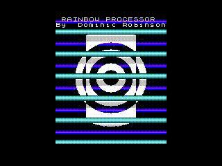

# Rainbow Effects Processor

The August 1987 edition of Your Sinclair magazine must be one of the most stunning issues in UK gaming magazine history. Not only did it feature some all time classic games such as Exolon and Zynaps (why oh why did that one not get a Megagame award? -Ed), but there were 2 machine code type-ins from the hottest authors of the era. One of them was an impressive multi-channel 1-bit music track from legendary composer and programmer Tim Follin. The other was a graphical demo by Zynaps-creator Dominic Robinson.

A demo which I still find mindblowing nearly 40 years later.

## The demo

The ZX Spectrum was famous for its limited colour abilities; trying to place 3 colours in close proximity could lead to "attribute clash" where the 3rd colour would bleed into one of the others, in a square blocky pattern. Mr Robinson's demo manages to have 3, 4 or 5 colours gliding past each other, with no attribute clash at all. A-maz-ing.

## Implementation

The demo works by changing the colour of a whole 160x8 pixel block of colour just before the electron gun starts drawing that pixel line on the screen. The whole block is changed colour again before the gun reaches the next pixel line, and that gets drawn in the next colour. The previous line, which is already drawn to screen, is not affected by this switch. Therefore, each 160x8 block can have 8 horizontal lines of different colours. With a bit of effort, these lines can be animated between frames.

## Decompilation

Although I typed the hex listing into my ZX Spectrum Plus in 1987, I was in no hurry to do that again. Instead, I grabbed a .TAP file of the demo and cut out the code section in a binary blob. I verified this was successful by loading it into an `INCBIN` section in an assembly file and stepping through it with a debugger. I then produced a raw dissasembly with `z80dasm` and iteratively tested, transcribed, annotated and timed each section. The product is presented here as the `rainbow.asm` file, which assembles cleanly with `sjasmplus` and can be easily adapted to suit other assemblers. Hopefully the combination of comments, labels and structure will help to explain the magic in this routine.

Note that the demo will produce a blank screen for a while as the BASIC routine creates the graphical background. Be patient - the effect is worth waiting for.

## Building

The routine can be built by `sjasmplus`. For an example invocation, see the `Makefile`. Alternatively, use the `Makefile` to build the library (`rainbow_code.tap`), full demo including BASIC routine (`rainbow_demo.tap`, which requires `zmakebas` to build the BASIC part), and the `myprog.sna` and `myprog.sld` files which contain some example code and can be used in a debugger. On systems which have Docker running, a dev container is provided which can be launched by VS Code and contains all of the needed tools; just type `make` into the terminal or use the `Makefile` tab in the left bar.

## To-do

I'm very impressed by the way Mr Robinson got the timings right for this routine, despite the complexities of dealing with contended RAM on the Spectrum. If you have insights about how the timing was worked out, please leave a comment in the Issues or create a pull request to document it.
